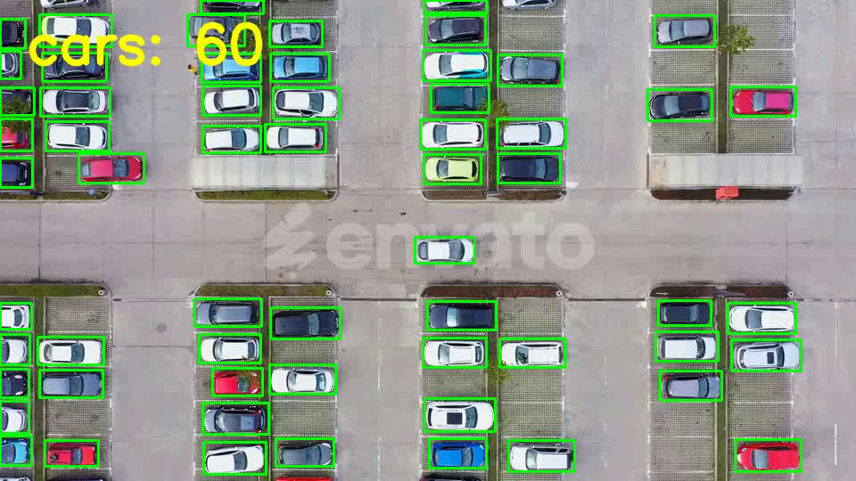

# Car Counting

<div align="center">

### 🎥 Demo Video

<video src="assets/output_sample.mp4" controls width="100%" autoplay loop muted>
  Your browser does not support the video tag.
</video>

** برای پخش کامل روی تصویر زیر کلیک کن:**

[](assets/output_sample.mp4)

</div>

## Overview
This project is a car-counting pipeline built around a YOLOv8 object detection model. It detects cars in video footage and produces sample output videos with bounding boxes and counting results.

## Project Files
- [assets/output_sample.mp4](assets/output_sample.mp4) — Demo output video
- [assets/input_sample.mp4](assets/input_sample.mp4) — Sample input video
- [train_code.ipynb](train_code.ipynb) — Training and experimentation notebook
- [label_fixer.py](label_fixer.py) — Utility for fixing label indexing issues
- [models/best_int8.onnx](models/best_int8.onnx) — Exported ONNX model
- [runs/detect/train/weights/best.pt](runs/detect/train/weights/best.pt) — Trained model weights

## Features
- Car detection using YOLOv8
- Video-based inference and counting
- Training artifacts included in the repository
- Exported ONNX model for deployment use

## Requirements
```bash
pip install -r requirements.txt

## Usage
1. Open [train_code.ipynb](train_code.ipynb) to inspect the training workflow.
2. Use the trained weights in [runs/detect/train/weights/best.pt](runs/detect/train/weights/best.pt) for inference.
3. Replace the input video path as needed to run the detector on your own footage.

## Notes
The repository also includes training logs and evaluation images under [runs/detect/train](runs/detect/train), which can be useful for reviewing model performance.
